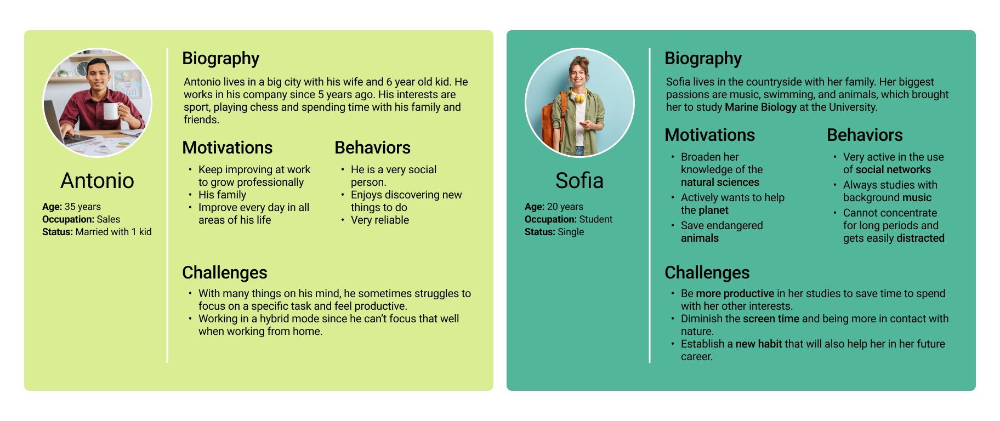
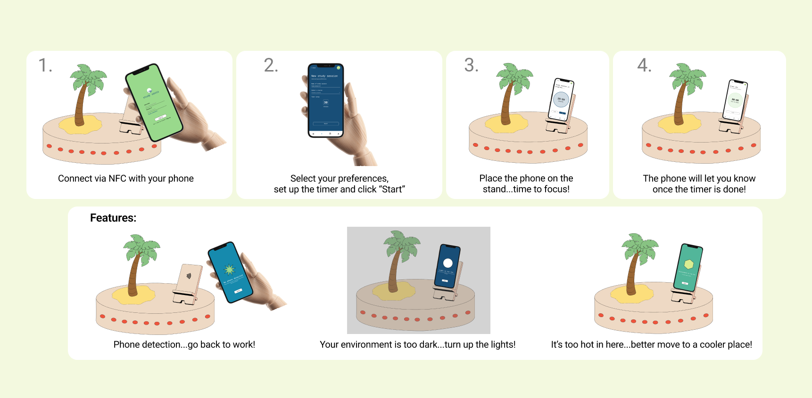
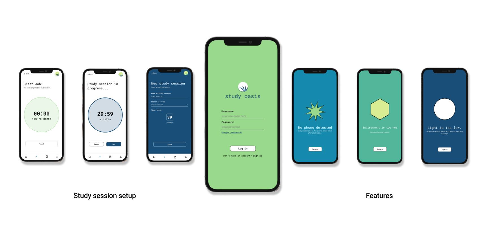
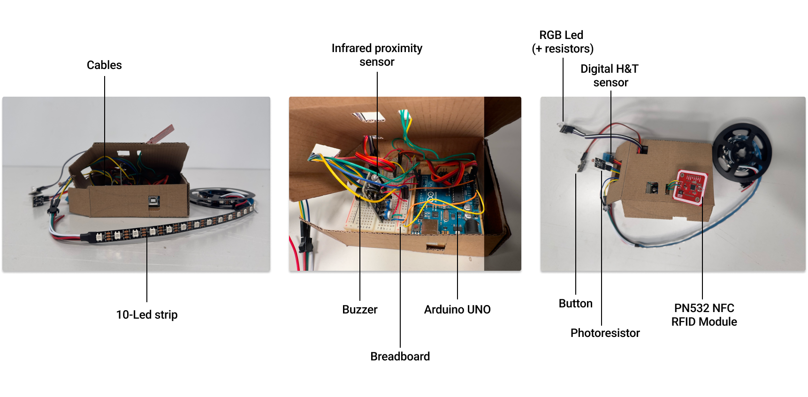
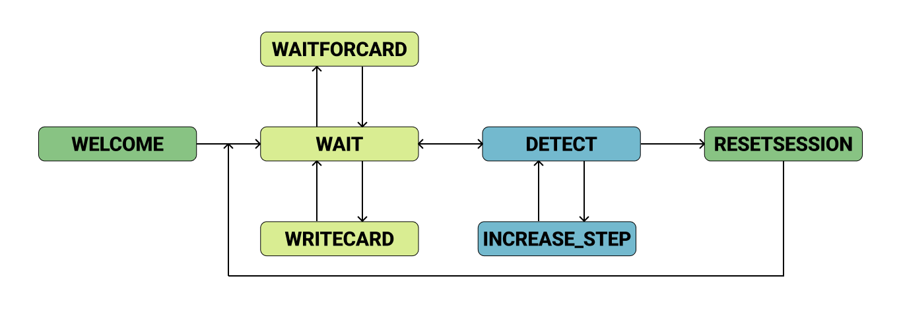
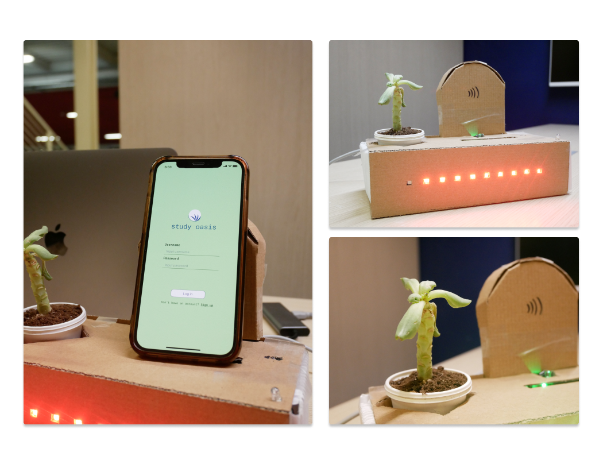

# StudyOasis

Project by [Sara Sorrentino](https://www.linkedin.com/in/sarasorrentino28/) & [Andrea Villarreal](https://www.linkedin.com/in/andreavillarreale-98/) for _Hardware & Software Technologies for Design_ (September 2022 - January 2023).

## Project Overview
The purpose of StudyOasis is to help students and workers concentrate on their tasks by blocking the distractions caused by smartphone use.

The user must place the phone on the base and start the timer to ensure a concentration session without distractions from the smartphone. If the user picks up the phone before the time runs out, he will be encouraged by the application to return to focus.

Study Oasis also allows you to monitor the working environment:
- The phone will alert you if the ambient light is too weak;
- An alarm will also sound if the ambient temperature is not in line with the user's preferences.

### Personas - Users

### Storyboard - Interaction description

## The Application

The application let the user set up their own preferences for the study session and save an history of them. It was prototyped by using [Protopie](https://www.protopie.io) & Protopie Connect for the communication of data with the Arduino.

## The Hardware 

## The Software

## The Final Product
Consists of an inner box that retains the Arduino in place and an external box in which: 
The phone can be placed and senses the presence of it
The progress bar can be seen, indicating the time passed in the study session
A LED light indicates if conditions are well (green) or there is something wrong (red) 
A decorative palm plant :) 

Check out the final presentation [video](https://polimi365-my.sharepoint.com/personal/10947355_polimi_it/_layouts/15/stream.aspx?id=%2Fpersonal%2F10947355%5Fpolimi%5Fit%2FDocuments%2FFinal%20Video%20Study%20Oasis%2Emp4&nav=eyJyZWZlcnJhbEluZm8iOnsicmVmZXJyYWxBcHAiOiJPbmVEcml2ZUZvckJ1c2luZXNzIiwicmVmZXJyYWxBcHBQbGF0Zm9ybSI6IldlYiIsInJlZmVycmFsTW9kZSI6InZpZXciLCJyZWZlcnJhbFZpZXciOiJNeUZpbGVzTGlua0NvcHkifX0&ga=1&referrer=StreamWebApp%2EWeb&referrerScenario=AddressBarCopied%2Eview%2E3e36d61b%2D9d96%2D4b80%2D8f6f%2D95cf6fbb759a)!
